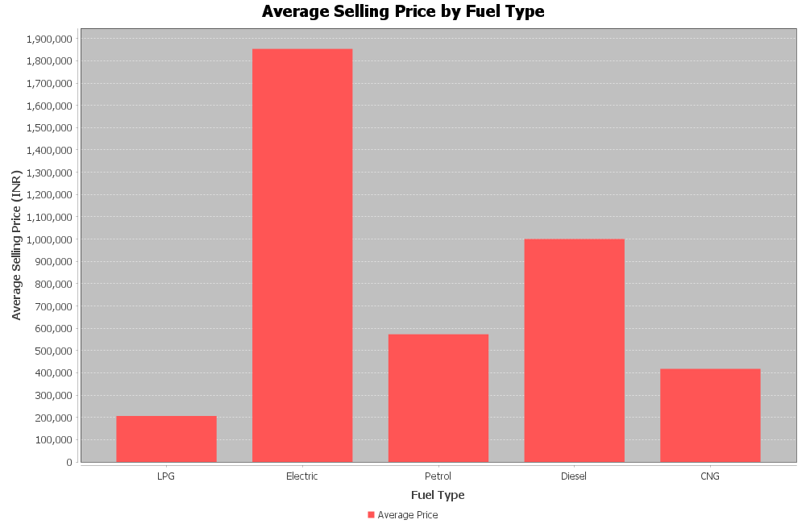
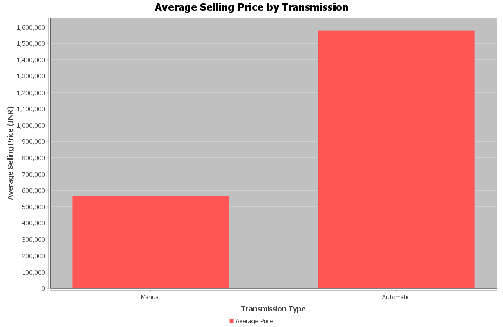
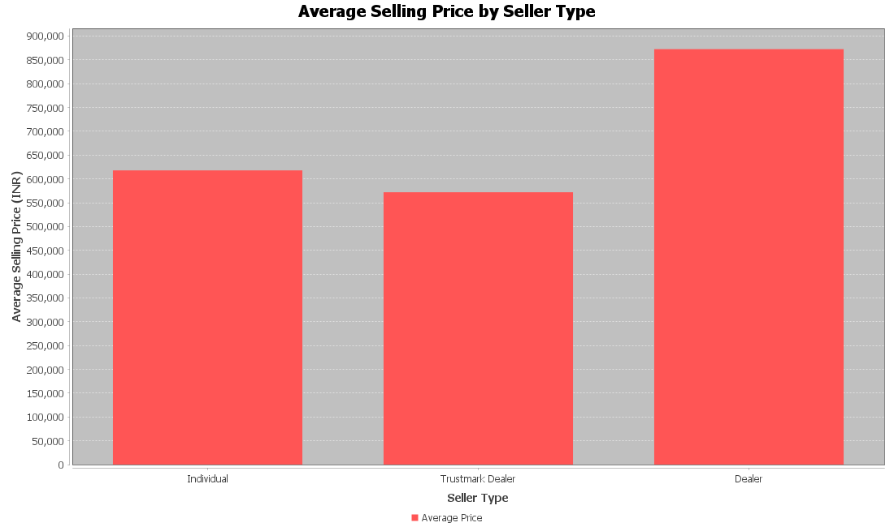
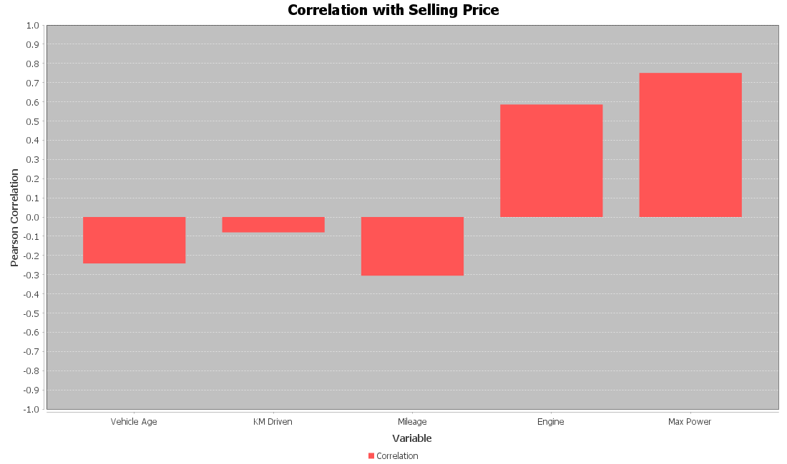
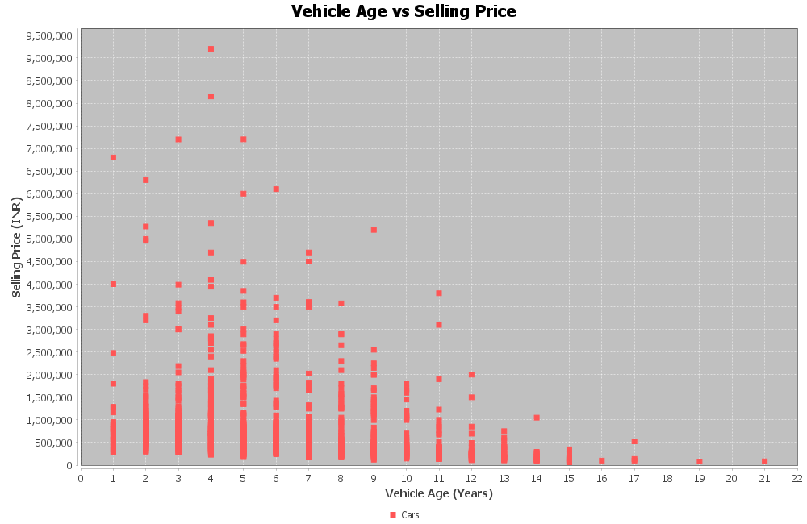
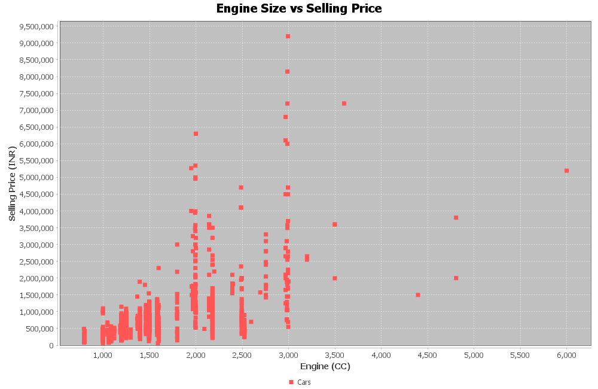
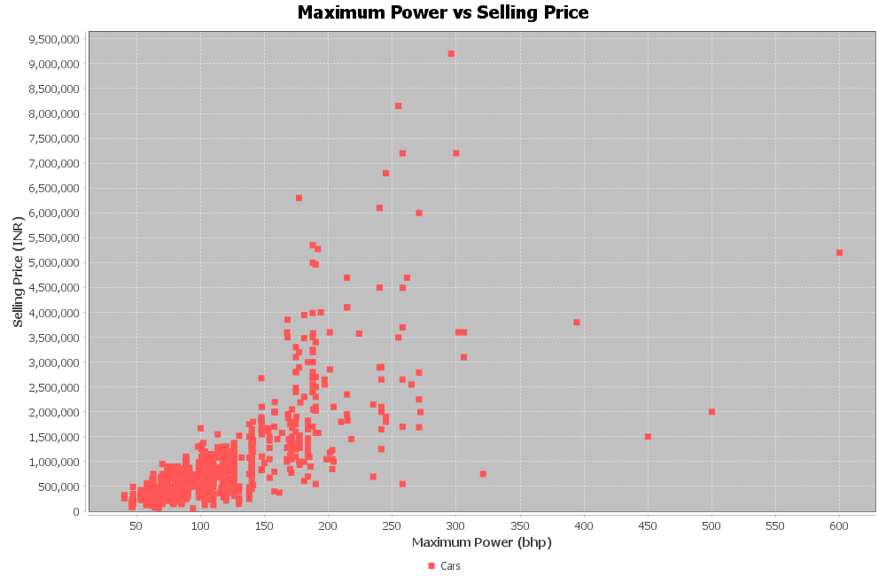

# Used Car Exploratory Data Analysis (EDA)

## 1. Project Overview

This project performs Exploratory Data Analysis (EDA) on a used-car dataset containing information about vehicle characteristics, seller details, fuel type, transmission type and selling price.

The project is implemented entirely in Java using Maven and is designed to identify patterns, relationships, trends and unusual observations within the dataset.

## 2. Objectives

- Load and process a real-world used-car dataset.
- Calculate statistical summaries for numerical variables.
- Analyze categorical variables.
- Compare average selling prices across different categories.
- Study relationships between vehicle characteristics and selling price.
- Identify potential outliers.
- Generate visualizations.
- Summarize important findings and insights.

## 3. Dataset Description

The dataset contains 15,411 used-car records.

| Attribute | Description |
|---|---|
| Car Name | Name of the vehicle |
| Brand | Vehicle manufacturer |
| Model | Vehicle model |
| Vehicle Age | Age of the vehicle in years |
| KM Driven | Distance driven by the vehicle |
| Seller Type | Type of seller |
| Fuel Type | Fuel used by the vehicle |
| Transmission Type | Manual or Automatic |
| Mileage | Fuel efficiency in km/l |
| Engine | Engine capacity in CC |
| Max Power | Maximum engine power in bhp |
| Seats | Number of seats |
| Selling Price | Selling price of the vehicle |

## 4. Technologies Used

- Java 11
- Apache Maven
- Visual Studio Code
- JFreeChart
- CSV
- Exploratory Data Analysis

## 5. Project Structure

Used-Car-EDA/
│
├── data/
│   └── cardekho_dataset.csv
│
├── output/
│   ├── fuel_price.png
│   ├── transmission_price.png
│   ├── seller_price.png
│   ├── correlation.png
│   ├── age_vs_price.png
│   ├── engine_vs_price.png
│   └── power_vs_price.png
│
├── src/
│   └── main/
│       └── java/
│           ├── Main.java
│           ├── Car.java
│           ├── CSVReader.java
│           ├── Statistics.java
│           ├── EDAAnalysis.java
│           ├── CategoryAnalysis.java
│           ├── CorrelationAnalysis.java
│           ├── OutlierAnalysis.java
│           └── ChartGenerator.java
│
├── pom.xml
├── REPORT.md
└── README.md

## 6. Statistical Summary

| Variable | Mean | Median | Minimum | Maximum | Std. Dev. |
|---|---:|---:|---:|---:|---:|
| Vehicle Age | 6.04 | 6.00 | 0.00 | 29.00 | 3.01 |
| KM Driven | 55,616.48 | 50,000.00 | 100.00 | 3,800,000.00 | 51,616.87 |
| Mileage | 19.70 | 19.67 | 4.00 | 33.54 | 4.17 |
| Engine | 1,486.06 | 1,248.00 | 793.00 | 6,592.00 | 521.09 |
| Max Power | 100.59 | 88.50 | 38.40 | 626.00 | 42.97 |
| Selling Price | 774,971.12 | 556,000.00 | 40,000.00 | 39,500,000.00 | 894,099.35 |

### Statistical Observations

The average vehicle age is approximately 6 years.

The average distance driven is approximately 55,616 km. The maximum recorded distance is 3,800,000 km, indicating extreme observations.

The average engine capacity is approximately 1,486 CC.

The average maximum power is approximately 100.59 bhp.

The average selling price is approximately INR 774,971, while the median selling price is INR 556,000.

The difference between the mean and median indicates that expensive vehicles influence the average selling price.

The maximum recorded selling price is INR 39,500,000.

## 7. Categorical Analysis

### 7.1 Fuel Type Distribution

| Fuel Type | Number of Cars |
|---|---:|
| Petrol | 7,643 |
| Diesel | 7,419 |
| CNG | 301 |
| LPG | 44 |
| Electric | 4 |

Petrol and diesel vehicles dominate the dataset.

Petrol accounts for 7,643 records, while diesel accounts for 7,419 records.

Electric vehicles are extremely underrepresented with only 4 records, so their average price should be interpreted cautiously.

### 7.2 Transmission Distribution

| Transmission | Number of Cars |
|---|---:|
| Manual | 12,225 |
| Automatic | 3,186 |

Manual vehicles make up the majority of the dataset.

### 7.3 Seller Type Distribution

| Seller Type | Number of Cars |
|---|---:|
| Dealer | 9,539 |
| Individual | 5,699 |
| Trustmark Dealer | 173 |

Dealer listings represent the largest seller category.

## 8. Average Selling Price Analysis

### 8.1 Average Price by Fuel Type

| Fuel Type | Average Selling Price |
|---|---:|
| LPG | INR 206,272.73 |
| Electric | INR 1,853,500.00 |
| Petrol | INR 572,861.95 |
| Diesel | INR 1,000,469.34 |
| CNG | INR 417,687.71 |

Electric vehicles have the highest average selling price at INR 1,853,500. However, only four electric vehicles are present in the dataset.

Among the major fuel categories, diesel vehicles have a considerably higher average selling price than petrol vehicles.

### 8.2 Average Price by Transmission

| Transmission | Average Selling Price |
|---|---:|
| Manual | INR 565,285.22 |
| Automatic | INR 1,579,556.81 |

Automatic vehicles have a substantially higher average selling price than manual vehicles.

The average automatic vehicle price is approximately 2.8 times the average manual vehicle price.

### 8.3 Average Price by Seller Type

| Seller Type | Average Selling Price |
|---|---:|
| Individual | INR 617,880.48 |
| Trustmark Dealer | INR 571,959.54 |
| Dealer | INR 872,505.50 |

Dealer-listed vehicles have the highest average selling price among the three seller categories.

## 9. Brand Analysis

The dataset contains a wide range of vehicle brands with substantial differences in average selling price.

| Brand | Average Selling Price | Records |
|---|---:|---:|
| Ferrari | INR 39,500,000.00 | 1 |
| Rolls-Royce | INR 24,200,000.00 | 1 |
| Bentley | INR 9,266,666.67 | 3 |
| Maserati | INR 6,100,000.00 | 2 |
| Porsche | INR 5,161,190.48 | 21 |
| Lexus | INR 5,146,500.00 | 10 |
| Volvo | INR 3,729,700.00 | 20 |

These results demonstrate that premium and luxury brands can have substantially higher selling prices.

However, several luxury-brand categories contain very few observations, so their averages should be interpreted cautiously.

### Most Represented Brands

| Brand | Number of Cars |
|---|---:|
| Maruti | 4,992 |
| Hyundai | 2,982 |
| Honda | 1,485 |
| Mahindra | 1,011 |
| Toyota | 793 |
| Ford | 790 |
| Volkswagen | 620 |
| Renault | 536 |

Maruti has the largest number of observations with 4,992 vehicles.

## 10. Correlation Analysis

Pearson correlation was used to examine the linear relationship between numerical vehicle characteristics and selling price.

| Variable | Correlation | Interpretation |
|---|---:|---|
| Vehicle Age | -0.2419 | Weak Negative |
| KM Driven | -0.0800 | Very Weak Negative |
| Mileage | -0.3055 | Moderate Negative |
| Engine | 0.5858 | Moderate Positive |
| Max Power | 0.7502 | Strong Positive |

### Maximum Power

Maximum Power has the strongest correlation with selling price:

r = 0.7502

This indicates a strong positive linear relationship. Vehicles with greater maximum power generally tend to have higher selling prices.

### Engine

Engine capacity has a correlation of 0.5858, representing a moderate positive relationship with selling price.

### Mileage

Mileage has a correlation of -0.3055, indicating a moderate negative relationship.

### Vehicle Age

Vehicle age has a correlation of -0.2419, indicating a weak negative relationship.

### KM Driven

KM Driven has a correlation of -0.0800, indicating a very weak negative relationship.

## 11. Outlier Analysis

The Interquartile Range (IQR) method was used to identify potential outliers in selling price.

| Measure | Value |
|---|---:|
| Minimum | INR 40,000 |
| Q1 | INR 385,000 |
| Median | INR 556,000 |
| Q3 | INR 825,000 |
| Maximum | INR 39,500,000 |
| IQR | INR 440,000 |
| Lower Bound | INR -275,000 |
| Upper Bound | INR 1,485,000 |
| Potential Outliers | 1,386 |
| Outlier Percentage | 8.99% |

The upper IQR boundary is INR 1,485,000.

There are 1,386 potential outliers, representing approximately 8.99% of the dataset.

The extreme maximum price of INR 39,500,000 strongly affects the mean selling price.

These observations were retained because they may represent genuine premium or luxury vehicles rather than data-entry errors.

## 12. Key Insights

1. Maximum Power is the strongest numerical factor associated with selling price, with a correlation of 0.7502.

2. Engine capacity has a moderate positive relationship with price, with a correlation of 0.5858.

3. Automatic vehicles have substantially higher average prices than manual vehicles.

4. Diesel vehicles have a higher average selling price than petrol vehicles.

5. Vehicle age has a negative relationship with price.

6. KM Driven has very little linear correlation with price.

7. Dealer vehicles have the highest average selling price among seller categories.

8. Luxury brands have extremely high average prices, although many luxury-brand categories contain very few observations.

9. The selling-price distribution contains significant high-price outliers.

10. The median selling price is considerably lower than the mean, indicating that expensive vehicles pull the average upward.

## 13. Visualizations

The project generates seven visualizations.

### Average Selling Price by Fuel Type

### Average Selling Price by Transmission

### Average Selling Price by Seller Type

### Correlation with Selling Price

### Vehicle Age vs Selling Price

### Engine vs Selling Price

### Maximum Power vs Selling Price

## 14. Project Output

The Java application successfully generated the following files:

output/
- fuel_price.png
- transmission_price.png
- seller_price.png
- correlation.png
- age_vs_price.png
- engine_vs_price.png
- power_vs_price.png

Total records analyzed: 15,411

Total charts generated: 7

## 15. Limitations

### Small Category Sizes

Some categories contain very few records.

Examples:

- Electric: 4 records
- LPG: 44 records
- Ferrari: 1 record
- Rolls-Royce: 1 record
- Bentley: 3 records
- Maserati: 2 records

Therefore, their average prices may not represent the broader used-car market.

### Outliers

The dataset contains high-value vehicles that significantly influence the average selling price.

### Correlation Does Not Imply Causation

A correlation between two variables does not prove that one variable causes the other.

### Limited Variables

The dataset does not capture every factor that can affect used-car prices, such as:

- Vehicle condition
- Accident history
- Number of previous owners
- Service history
- Location-specific demand
- Modifications
- Insurance history

## 16. Conclusion

The Used Car Exploratory Data Analysis project successfully analyzed 15,411 used-car records using Java.

Statistical summaries, categorical analysis, correlation analysis, outlier detection and visualization were used to identify important patterns within the dataset.

The analysis found that Maximum Power has the strongest numerical relationship with selling price, with a Pearson correlation of 0.7502.

Engine capacity also showed a moderate positive relationship with price.

Automatic vehicles had a considerably higher average selling price than manual vehicles, while diesel vehicles had a higher average selling price than petrol vehicles.

The analysis also identified significant high-price outliers. Using the IQR method, 1,386 records were identified as potential outliers, representing 8.99% of the dataset.

Overall, the project demonstrates how exploratory data analysis can be used to understand patterns, relationships and influential factors in used-car pricing.

The results provide a strong foundation for developing a future machine-learning model for used-car price prediction.

## 17. Future Scope

The project can be extended in several ways:

- Build a machine-learning model to predict used-car prices.
- Compare Linear Regression, Random Forest and Gradient Boosting models.
- Perform feature engineering.
- Analyze brand and model-level pricing patterns.
- Perform hypothesis testing.
- Apply multiple regression.
- Create an interactive dashboard.
- Add geographic analysis.
- Investigate price trends across vehicle age groups.
- Compare luxury and mass-market vehicle segments.
- Develop a web-based used-car price prediction application.

## 18. Final Project Status

Dataset Loaded: SUCCESS

Total Records: 15,411

Statistical Analysis: COMPLETED

Categorical Analysis: COMPLETED

Brand Analysis: COMPLETED

Correlation Analysis: COMPLETED

Outlier Analysis: COMPLETED

Visualizations: COMPLETED

Report: COMPLETED

Charts Generated: 7

==============================================================
                    PROJECT COMPLETE
==============================================================

## Technologies

Java | Maven | JFreeChart | CSV | Exploratory Data Analysis

## Author

Used Car EDA Project

Yashika Mohanty

Bachelor of Technology - Computer Science / Data Science